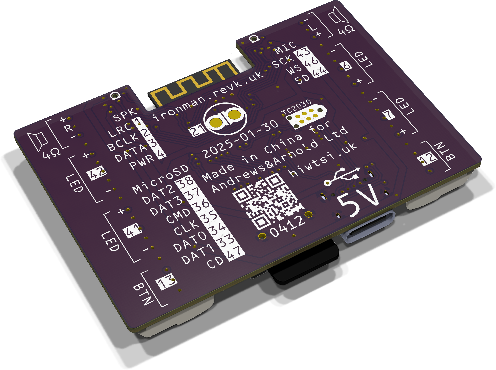
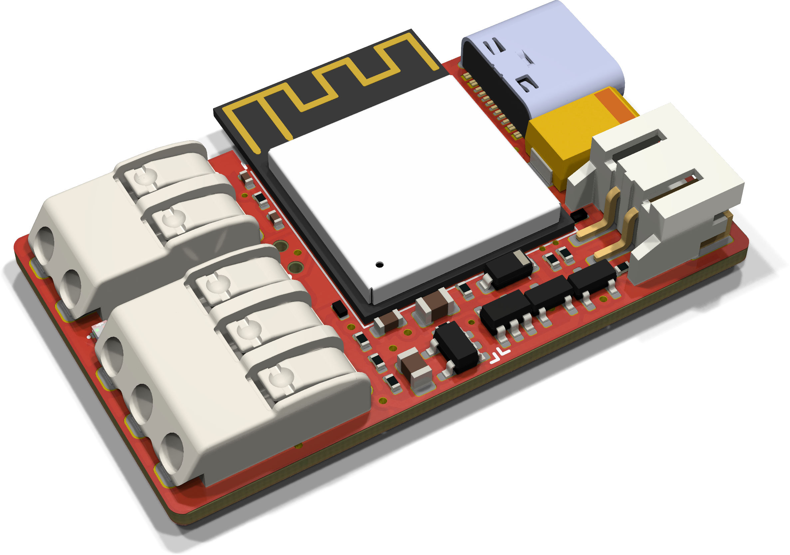
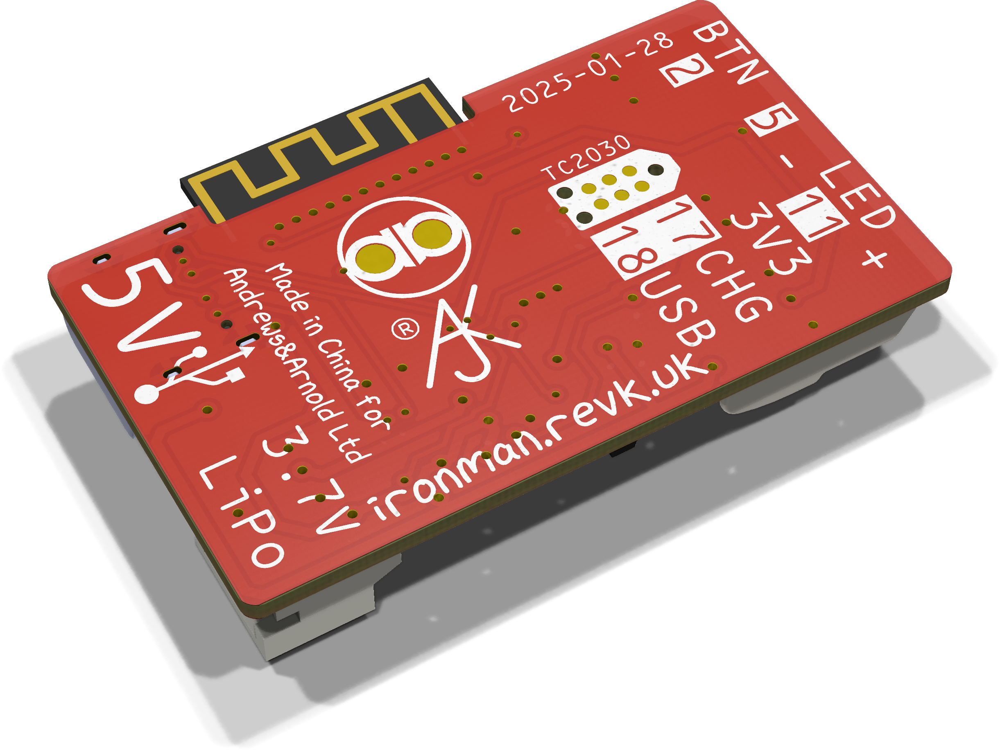

# ESP32-IronMan

Software and PCBs for an IronMan suit.

## Basic operation

The *button* can be pressed mutliple times if needed, and after half a second it acts based on number of presses.

|Part|Presses|Action|
|----|-------|------|
|Helmet|1|Toggle visor up/down - plays `OPEN` or `CLOSE`|
|Helmet|2|Glitch LEDs to simulate a fault, then off for 10 seconds|
|Helmet|3|Toggle cylon mode (eyes cycle red, instead of static cyan) - plays `CYLON` when activated|
|Glove|1|Light pulse effect|

In addition, (except for visor 1/2/3), an audio file is played named with `SUIT`, `HELMET`, `RGLOVE`, or `LGLOVE` followed by number of presses. This allows custom sound effects for multiple presses on each device.

### Power off/on

Hold button for 3 seconds to power off, press again to power back on.

## Audio files

Audio files all end `.WAV` and should be WAV PCM format using a standard sample rate.

|File|Meaning|
|----|-------|
|`POWERON`|Suit power on|
|`POWEROFF`|Suit power off|
|`UPGRADE`|Suit software upgrade (all LEDs pale blue)|
|`RESTART`|Suit restart (after s/w upgrade)|
|`OPEN`|Visor open|
|`CLOSE`|Visor close|
|`CYLON`|Cylon mode|
|`GLITCH`|When glitch activated|
|`SUITn`|Suit press N times|
|`HELMETn`|Helment press N times (not 1/2/3)|
|`LGLOVEn`|Left gloves press N times|
|`RGLOVEn`|Right glove press N times|

The sound for the glove light pulse shoudl be `LGLOVE1` and `RGLOVE1` - you could adjust stereo for which side maybe.

## Settings

There are many settings, GPIOs, LED config, colours, etc.

## PCBs

### Controller board (Suit/Helmet)

Speaker driver, two button inputs, and 4 output (e.g. LED or PWM).

### Gloves

Desigend to work with small LiPo in glove, charger circuit from USB, one button input, 88 32mm LED ring.

